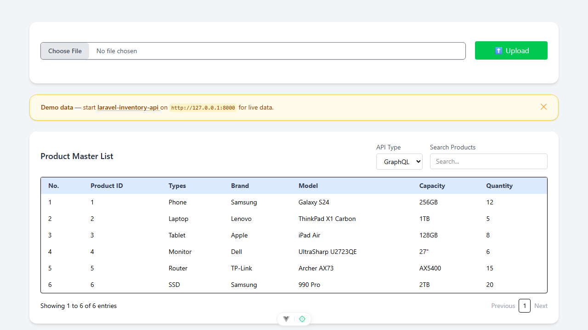

# Vue Inventory UI

A single-page Vue 3 + Vite app for managing a product master list: bulk-upload products
from an `.xlsx` file and browse the list in a searchable, paginated table. The table can
fetch its data from a companion backend over **REST or GraphQL** (user-switchable), and
the upload posts the spreadsheet to the same backend. This repo is the frontend only —
the backend is a separate project (see [Backend](#backend) below).



*The app running on `http://localhost:8102` without the backend: the upload card and the
Product Master List render, but the table is empty because every REST/GraphQL fetch fails.
Start the backend to see data.*

> **New developer? Start with [`.docs/tldr.md`](.docs/tldr.md)** — every doc summarised on one
> page. The full guide lives in [`.docs/`](.docs/README.md).

## Backend

This UI talks to
**[laravel-inventory-api](https://github.com/dxiiren/laravel-inventory-api)** —
a Laravel API that imports the uploaded spreadsheet via Laravel Excel and serves the
product list over both REST and GraphQL. It also has features this UI does not surface
yet: a per-upload **import report** (row-level accepted/rejected results) and **idempotent
imports** (re-uploading the same file won't duplicate rows).

The base URL is hardcoded as `http://127.0.0.1:8000` in `src/views/HomeView.vue`
(`const baseURL`), and three endpoints are used:

| Endpoint | Used for |
| --- | --- |
| `POST /api/products/import` | `.xlsx` upload (multipart form, field `file`) |
| `GET /api/products?page=N&search=…` | product list, REST mode |
| `POST /api/graphql` | product list, GraphQL mode (`products` query) |

Without the backend running, the page still loads but the table stays empty (see
Troubleshooting).

## Prerequisites

| Tool | Version | Installed by |
| --- | --- | --- |
| PowerShell + winget | Windows 10/11 stock | — (the only true prerequisites) |
| Git | any recent | `setup.ps1` (winget) |
| Node.js | LTS (verified on v24) | `setup.ps1` (winget) |
| just | any recent | `setup.ps1` |
| Claude Code CLI | latest | `setup.ps1` (optional, for AI-assisted dev) |

## Quick start

```powershell
# 1. One-time machine setup (idempotent — safe to re-run)
pwsh ./setup.ps1

# 2. Close and reopen PowerShell so PATH updates land

# 3. Install dependencies (npm ci from the lockfile)
just install

# 4. Start the dev server
just start
```

The app is now at **http://localhost:8102**. Stop it with `just stop`.
(Use `localhost`, not `127.0.0.1` — Vite binds the IPv6 loopback `[::1]` here.)

## Commands

Run `just` with no arguments to list every recipe. The ones you'll use daily:

| Command | What it does |
| --- | --- |
| `just install` | Install dependencies (`npm ci`) |
| `just start` | Dev server on :8102 in a background window |
| `just dev` | Dev server in the foreground (Ctrl+C to stop) |
| `just stop` | Stop only THIS repo's node processes |
| `just build` | Production build to `dist/` |
| `just preview` | Serve the production build on :8102 |
| `just lint` | ESLint with auto-fix (`eslint . --fix`) |
| `just format` | Prettier write on `src/` |
| `just test` | Vitest single run (`vitest --run`) |
| `just claudex` | Launch Claude Code (Sonnet, all permissions) |

## Testing

Unit tests run with **Vitest 3** (jsdom + `@vue/test-utils`), configured in
`vitest.config.js` (merges `vite.config.js`, so the `@` → `src/` alias works in specs).

```powershell
just test              # single run (vitest --run)
just test HomeView     # pass-through filter: only specs matching "HomeView"
npm run test:unit      # watch mode
```

Specs live next to the code they cover, e.g.
`src/views/__tests__/HomeView.spec.js` — mounts the main view with a mocked axios
module and asserts that the GraphQL fetch on mount renders table rows, that switching
the API type re-fetches from the REST endpoint, and that an upload posts the
spreadsheet as `FormData` to `/api/products/import`. No backend is needed: all HTTP
is mocked with `vi.mock('axios')`.

## Troubleshooting

### `127.0.0.1:8102` refuses to connect but the server is running

Vite binds the IPv6 loopback (`[::1]`) on this setup — use `http://localhost:8102`, not the
IPv4 literal.

### Product table is empty and the console shows "Error loading products"

The app expects its backend API at `http://127.0.0.1:8000` (hardcoded in
`src/views/HomeView.vue`). Without that backend running, the page still loads but every
REST/GraphQL fetch fails and the table stays empty. Start
[laravel-inventory-api](https://github.com/dxiiren/laravel-inventory-api),
or expect an empty table during frontend-only work.

### `just start` window closes immediately / "Port 8102 is already in use"

The dev server runs with `--strictPort`, so it exits instead of hopping ports. Run
`just stop` to kill a lingering server from this repo, or find the squatter with
`netstat -ano | findstr :8102` and stop it.

### `just` or `node` not found after running setup.ps1

PATH changes land in new shells only. Close and reopen PowerShell, then retry. If it
persists, re-run `pwsh ./setup.ps1` and read its `[FAIL]`/`[WARN]` lines.

More in [`.docs/06-troubleshooting/common-issues.md`](.docs/06-troubleshooting/common-issues.md).

## Project layout

```
vue-inventory-ui/
  index.html               # Vite entry page
  vite.config.js           # Vue + devtools + Tailwind v4 plugins, @ -> src alias
  vitest.config.js         # jsdom test env (merges vite.config.js)
  eslint.config.js         # ESLint 9 flat config (vue + vitest + prettier)
  justfile, setup.ps1      # dev recipes + machine bootstrap
  src/
    main.js                # createApp + Pinia + router + VeeValidate plugin
    App.vue                # bare <router-view />
    router/index.js        # single route: / -> HomeView
    views/HomeView.vue     # page shell: upload card + product table; all API calls
    views/__tests__/HomeView.spec.js  # Vitest spec (mocked axios; render + endpoints)
    components/
      UploadProduct.vue    # .xlsx upload form (VeeValidate rules)
      product/ProductIndex.vue  # searchable, paginated product table
    composables/useDebouncedRef.js  # 500 ms debounced customRef (search box)
    includes/validation.js # global VeeValidate plugin: rules + messages
    stores/counter.js      # Pinia scaffold store (unused)
    assets/                # Tailwind v4 entry css + base styles
  docs/images/             # README assets (app screenshot)
  .docs/                   # developer documentation (start at tldr.md)
  .claude/                 # Claude Code skills, settings, statusline
```
